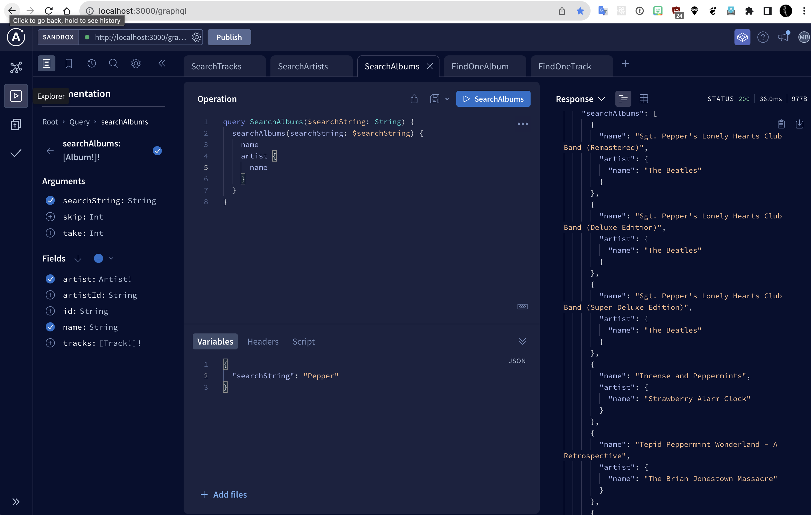

# LastFM GraphQL Demo

This is a demo project using exported [Last.fm](https://last.fm) data to create a GraphQL API.

`NestJS` / `Postgresql` / `GraphQL` / `Apollo` / `Prisma` / `TypeScript` / `Docker`

## Requirements

- [docker compose](https://docs.docker.com/compose/install/)
- [nvm](https://github.com/nvm-sh/nvm)

## Setup (Local)

Create the `.env` file 

```sh
cp .env.sample .env
```

### Create the db

Start postgres

```sh
docker compose build
docker compose up -d

# until we have the server configured for docker or whatever, just use local npx
nvm use
npx prisma migrate dev
```

```sh
# TODO: switch to this later
# docker compose run --rm server npx prisma init
```

### `Import From Last.FM`

Export your LastFM list from [here](https://benjaminbenben.com/lastfm-to-csv/)

Import the raw data into the Scrobble table:

```
COPY Scrobble(artist, album, track, datecreated)
FROM last_fm_export.csv'
DELIMITER ','
CSV HEADER;
```
or via docker:

```sh
docker run --rm -e PGPASSWORD=postgres --network=host \
     -v $(pwd):/data postgres psql -h host.docker.internal \
     -p 5432 -U postgres -d scrobbled -c "\\copy \"Scrobble\"(artist, album, track, datecreated) \
         FROM '/data/my-lastfm-export.csv' with csv"
```

Then populate the data using your [favourite SQL client](https://dbeaver.io/)

```sql
INSERT INTO "Artist"(name)
SELECT DISTINCT Artist
FROM    "Scrobble";

-- todo: Handle the NULL album names
INSERT INTO "Album"("artistId", Name)
SELECT DISTINCT "Artist".id AS ArtistId,
                "Scrobble".Album AS Name
FROM "Scrobble"
    JOIN "Artist" ON "Scrobble".Artist="Artist".Name
    WHERE "Scrobble".album is not null;
```

```sql
INSERT INTO "Track"("albumId", name)
SELECT DISTINCT "Album".id, track FROM "Scrobble"
INNER JOIN "Album"
ON "Album".name = "Scrobble".album
INNER JOIN "Artist"
ON "Album"."artistId" = "Artist".id
AND "Scrobble".artist = "Artist".name;
```

### Startup

```
npm run start 
```

Then navigate to [http://localhost:3000/graphql](http://localhost:3000/graphql)

You should be able to run queries using the apollo playground:



## Original Setup Notes

This project was generated something like this:

```
npm install -g @nestjs/cli
nest new nestjs-scrobbled
cd nestjs-scrobbled
# see: https://docs.nestjs.com/recipes/prisma
npm install prisma --save-dev
npx prisma init
docker compose build
# start up postgres so we can run the migrations
docker compose up -d

# create the migrations
npx prisma migrate dev --name init
# various other migrations
# npx prisma migrate dev --name create-scrobble
# ...
```

As per the [NestJS prisma documentation](https://docs.nestjs.com/recipes/prisma#install-and-generate-prisma-client):

([see also](https://www.tomray.dev/nestjs-prisma))

To add graphql/apollo:

https://docs.nestjs.com/graphql/quick-start

```sh
npm install @prisma/client
```

Note that this invokes `prisma generate` automatically to create the client code from the schema

To generate a new resource template (select GraphQL Schema-First):

```sh
nest g resource test
```

## Notes

- The [original version](https://github.com/mikebridge/express-graphql-demo) of this used express-graphql, which is no longer supported, hence the migration to NestJS
